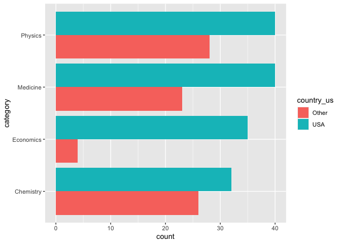
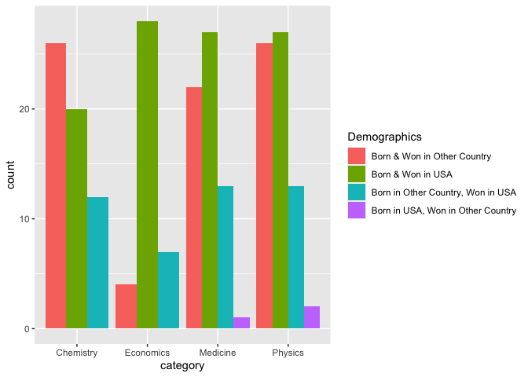

Lab 03 - Nobel laureates
================
Steph Bossert
06 Feb 21

### Load packages and data

``` r
library(tidyverse) 
```

``` r
nobel <- read_csv("data/nobel.csv")
view(nobel)
```

## Exercises

### Exercise 1

``` r
names(nobel)
```

    ##  [1] "id"                    "firstname"             "surname"              
    ##  [4] "year"                  "category"              "affiliation"          
    ##  [7] "city"                  "country"               "born_date"            
    ## [10] "died_date"             "gender"                "born_city"            
    ## [13] "born_country"          "born_country_code"     "died_city"            
    ## [16] "died_country"          "died_country_code"     "overall_motivation"   
    ## [19] "share"                 "motivation"            "born_country_original"
    ## [22] "born_city_original"    "died_country_original" "died_city_original"   
    ## [25] "city_original"         "country_original"

``` r
glimpse(nobel)
```

    ## Rows: 935
    ## Columns: 26
    ## $ id                    <dbl> 1, 2, 3, 4, 5, 6, 6, 8, 9, 10, 11, 12, 13, 14, …
    ## $ firstname             <chr> "Wilhelm Conrad", "Hendrik A.", "Pieter", "Henr…
    ## $ surname               <chr> "Röntgen", "Lorentz", "Zeeman", "Becquerel", "C…
    ## $ year                  <dbl> 1901, 1902, 1902, 1903, 1903, 1903, 1911, 1904,…
    ## $ category              <chr> "Physics", "Physics", "Physics", "Physics", "Ph…
    ## $ affiliation           <chr> "Munich University", "Leiden University", "Amst…
    ## $ city                  <chr> "Munich", "Leiden", "Amsterdam", "Paris", "Pari…
    ## $ country               <chr> "Germany", "Netherlands", "Netherlands", "Franc…
    ## $ born_date             <date> 1845-03-27, 1853-07-18, 1865-05-25, 1852-12-15…
    ## $ died_date             <date> 1923-02-10, 1928-02-04, 1943-10-09, 1908-08-25…
    ## $ gender                <chr> "male", "male", "male", "male", "male", "female…
    ## $ born_city             <chr> "Remscheid", "Arnhem", "Zonnemaire", "Paris", "…
    ## $ born_country          <chr> "Germany", "Netherlands", "Netherlands", "Franc…
    ## $ born_country_code     <chr> "DE", "NL", "NL", "FR", "FR", "PL", "PL", "GB",…
    ## $ died_city             <chr> "Munich", NA, "Amsterdam", NA, "Paris", "Sallan…
    ## $ died_country          <chr> "Germany", "Netherlands", "Netherlands", "Franc…
    ## $ died_country_code     <chr> "DE", "NL", "NL", "FR", "FR", "FR", "FR", "GB",…
    ## $ overall_motivation    <chr> NA, NA, NA, NA, NA, NA, NA, NA, NA, NA, NA, NA,…
    ## $ share                 <dbl> 1, 2, 2, 2, 4, 4, 1, 1, 1, 1, 1, 1, 2, 2, 1, 1,…
    ## $ motivation            <chr> "\"in recognition of the extraordinary services…
    ## $ born_country_original <chr> "Prussia (now Germany)", "the Netherlands", "th…
    ## $ born_city_original    <chr> "Lennep (now Remscheid)", "Arnhem", "Zonnemaire…
    ## $ died_country_original <chr> "Germany", "the Netherlands", "the Netherlands"…
    ## $ died_city_original    <chr> "Munich", NA, "Amsterdam", NA, "Paris", "Sallan…
    ## $ city_original         <chr> "Munich", "Leiden", "Amsterdam", "Paris", "Pari…
    ## $ country_original      <chr> "Germany", "the Netherlands", "the Netherlands"…

``` r
view(nobel)
```

\#\#Exercise 1 answers: observations: 26 columns x 935 entries = 24310
Variables: 26 variables Each variable represents demogrpahic information
about the nobel laurete

### Exercise 2

``` r
nobel_living <- nobel %>%
filter(is.na(died_date), (gender != "org"), (!is.na(country)))
view(nobel_living)

library(tidyverse)
nobel_living <- nobel_living %>%
  mutate(
    country_us = if_else(country == "USA", "USA", "Other")
  )
nobel_living_science <- nobel_living %>%
  filter(category %in% c("Physics", "Medicine", "Chemistry", "Economics"))
```

### Exercise 3

``` r
ggplot(data = nobel_living_science, aes(x= category, fill=country_us)) +
  geom_bar(stat = "count", position = position_dodge()) +
  coord_flip()
```

<!-- -->

### Exercise 4

``` r
nobel_living_science <- nobel_living_science %>%
  mutate(
    born_country_us = if_else(born_country == "USA", "USA", "Other")
  )
view(nobel_living_science)
table(nobel_living_science$born_country_us)
```

    ## 
    ## Other   USA 
    ##   123   105

``` r
  ###Answer: 147 born in the US
```

### Exercise 5

``` r
###create new vars for four conditions 
nobel_living_science<- nobel_living_science%>% 
  mutate(Demographics = case_when(born_country_us == "USA" & country_us == "USA" ~ "Born & Won in USA", #condition 1
                         born_country_us == "USA" & country_us == "Other" ~ "Born in USA, Won in Other Country", #condition 2
                         born_country_us == "Other" & country_us == "Other" ~ "Born & Won in Other Country", #condition 3
                         born_country_us == "Other" & country_us == "USA" ~ "Born in Other Country, Won in USA")) #condition 4
view(nobel_living_science)
ggplot(data = nobel_living_science)+ aes(x= category, fill= Demographics) +
  geom_bar(stat = "count", position = position_dodge())
```

<!-- -->

### Exercise 6

``` r
nobel_new<- filter(nobel_living_science, country_us == "USA", born_country_original != "USA")
view(nobel_new)
table(nobel_new$born_country_original)
```

    ## 
    ##                                 Australia 
    ##                                         2 
    ##                                   Austria 
    ##                                         1 
    ## British Mandate of Palestine (now Israel) 
    ##                                         2 
    ##                                    Canada 
    ##                                         4 
    ##                                     China 
    ##                                         5 
    ##                                   Finland 
    ##                                         1 
    ##                                    France 
    ##                                         1 
    ##                                   Germany 
    ##                                         5 
    ##                                   Ireland 
    ##                                         1 
    ##                                     Italy 
    ##                                         1 
    ##                                     Japan 
    ##                                         3 
    ##                                    Mexico 
    ##                                         1 
    ##                                    Norway 
    ##                                         2 
    ##                    Poland (now Lithuania) 
    ##                                         1 
    ##                      Poland (now Ukraine) 
    ##                                         1 
    ##                                  Scotland 
    ##                                         1 
    ##                              South Africa 
    ##                                         1 
    ##                                    Sweden 
    ##                                         1 
    ##                                    Taiwan 
    ##                                         1 
    ##                                    Turkey 
    ##                                         1 
    ##                            United Kingdom 
    ##                                         7 
    ##                West Germany (now Germany) 
    ##                                         2

``` r
count(nobel_new, 'born_country_original')
```

    ## # A tibble: 1 x 2
    ##   `"born_country_original"`     n
    ##   <chr>                     <int>
    ## 1 born_country_original        45

``` r
###Answer: 45 people won their prize in the US but were born outside the US. The Uk has the most amount of winners (7) born there but who won their prize in the US. 
```
